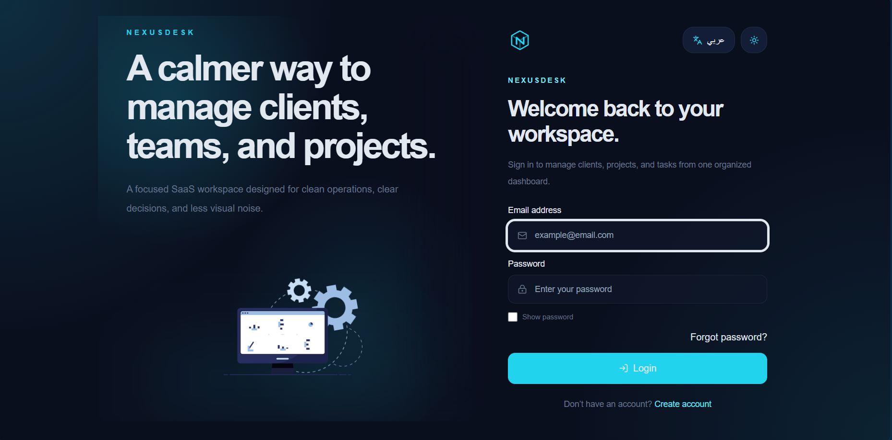
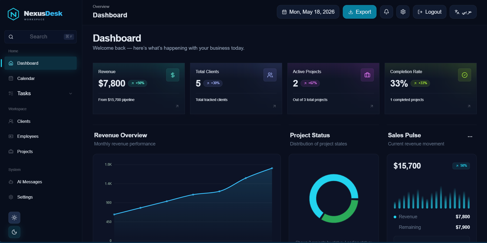
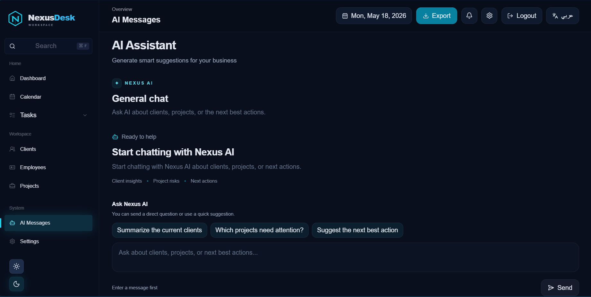

<div align="center">

# NexusDesk

Modern AI-powered SaaS workspace built with Next.js 16, React 19, TypeScript, Tailwind CSS v4, Supabase, Zustand, and Groq AI.

A premium dashboard experience for managing clients, projects, employees, tasks, scheduling, and AI-assisted workflows inside one clean workspace.

<br />


<br />

[Live Demo](https://nexusdesk-psi.vercel.app) • [GitHub Repository](https://github.com/HAKIM166/nexusdesk)

</div>

---

## Overview

NexusDesk is a modern SaaS-style dashboard and CRM workspace built as a professional portfolio project.

It combines business management features with AI assistance, authentication, localization, responsive UI, and a structured frontend architecture.

The platform includes:

- Dashboard analytics
- Clients management
- Projects management
- Employees management
- Tasks Kanban board
- Calendar scheduling
- AI assistant workspace
- Settings page
- Supabase authentication
- Arabic / English localization
- Dark / Light theme support

---

## Preview

### Authentication

Modern authentication experience with login, password reset, language switcher, and theme controls.



### Dashboard

Business dashboard with KPIs, charts, recent records, quick actions, and responsive workspace layout.



### AI Assistant

AI workspace connected to project and client context for smarter business suggestions.



---

## Live Features

- AI-powered dashboard assistant
- Supabase authentication
- Protected workspace routes
- Clients, projects, employees, tasks, and calendar modules
- Arabic / English localization
- RTL Arabic support
- Dark / Light theme system
- Responsive SaaS dashboard layout
- Modular frontend architecture
- Zustand-based state management
- Service layer for Supabase-backed data

---

## Core Features

### Dashboard System

- KPI overview cards
- Revenue analytics
- Project charts
- Recent clients and projects
- Quick actions
- Business workflow visualization

### Clients Management

- Clients listing
- Client creation and editing
- Client details pages
- Supabase-backed data
- Responsive tables and forms

### Projects Management

- Projects listing
- Project details pages
- Project forms
- Status management
- Budget and payment tracking
- Dashboard-connected project analytics

### Employees Management

Complete employee management system including:

- Employee profiles
- Employee details pages
- Employee statistics
- Department overview
- Skills editor
- Phone and location fields
- Employee photo support
- Responsive employee forms

### Tasks System

Kanban-style task workflow with:

- Backlog
- In Progress
- Done

Includes task cards, task columns, responsive layout, and task status organization.

### Calendar System

- Calendar events
- Upcoming events
- Scheduling interface
- FullCalendar integration

### AI Assistant

NexusDesk includes an AI assistant powered by Groq AI.

The assistant can work with dashboard context such as:

- Clients
- Projects
- Budgets
- Paid amounts
- Remaining amounts
- Business workflow data

AI API route:

```bash
src/app/api/ai/chat/route.ts
```

---

## Authentication & Access

Authentication is powered by Supabase.

Features include:

- Login
- Logout
- Password reset
- Session handling
- Protected dashboard routes
- Allowed dashboard users configuration
- Secure production redirects

Protected workspace areas include:

- Dashboard
- Clients
- Projects
- Employees
- Calendar
- Tasks
- AI Messages
- Settings

---

## Localization

NexusDesk supports:

- English
- Arabic with RTL layout

Localization files:

```bash
src/messages/en.json
src/messages/ar.json
```

The UI supports localized content, RTL direction, Arabic layout handling, and responsive Arabic typography.

---

## Theme System

The project uses a centralized CSS variable theme system.

Theme file:

```bash
src/styles/theme.css
```

Supports:

- Dark mode
- Light mode
- Shared design tokens
- Dashboard color variables
- Consistent UI styling

---

## Responsive Design

NexusDesk is optimized for:

- Desktop
- Tablet
- Mobile

Responsive work includes:

- Sidebar behavior
- Mobile dashboard scaling
- Adaptive tables
- Mobile forms
- Arabic RTL layouts
- Clean spacing and typography

---

## Tech Stack

### Frontend

- Next.js 16.2.4
- React 19
- TypeScript
- Tailwind CSS v4

### Backend & Services

- Supabase
- Groq AI

### State Management

- Zustand

### UI & Visualization

- Recharts
- FullCalendar
- Framer Motion
- Lucide React
- Lottie React
- React Easy Crop
- React Phone Number Input

---

## Project Architecture

```bash
src
├── app
├── components
├── config
├── data
├── hooks
├── lib
├── messages
├── services
├── store
├── styles
└── types
```

### App Router

```bash
src/app/[locale]
```

Main routes include:

- dashboard
- clients
- clients/[id]
- projects
- projects/[id]
- employees
- employees/[id]
- calendar
- tasks
- tasks/backlog
- tasks/in-progress
- tasks/done
- messages-ai
- settings
- login
- reset-password
- terms
- privacy
- documentation

### Components

```bash
src/components
```

Organized by domain:

- ai
- auth
- calendar
- clients
- common
- dashboard
- employees
- layout
- marketing
- projects
- tasks
- ui

### Services Layer

```bash
src/services
```

Includes service modules for:

- AI
- Clients
- Projects
- Employees
- Calendar
- Tasks

### State Management

```bash
src/store
```

Zustand stores include:

- client-store
- project-store
- employee-store
- task-store
- calendar-store
- notification-store
- ui-store

### Supabase Layer

```bash
src/lib/supabase
```

Includes client/server Supabase helpers and auth-related utilities.

---

## Environment Variables

Create a `.env.local` file in the project root:

```env
GROQ_API_KEY=

NEXT_PUBLIC_SUPABASE_URL=
NEXT_PUBLIC_SUPABASE_ANON_KEY=

NEXT_PUBLIC_SITE_URL=

NEXT_PUBLIC_ALLOWED_DASHBOARD_EMAILS=
```

### Notes

- `GROQ_API_KEY` is used for the AI assistant.
- `NEXT_PUBLIC_SUPABASE_URL` and `NEXT_PUBLIC_SUPABASE_ANON_KEY` are required for Supabase.
- `NEXT_PUBLIC_SITE_URL` should point to the production URL on Vercel.
- `NEXT_PUBLIC_ALLOWED_DASHBOARD_EMAILS` controls which emails can access the protected dashboard workspace.

---

## Installation

Clone the repository:

```bash
git clone https://github.com/HAKIM166/nexusdesk.git
```

Navigate into the project:

```bash
cd nexusdesk
```

Install dependencies:

```bash
npm install
```

Start the development server:

```bash
npm run dev
```

Build for production:

```bash
npm run build
```

Start production server:

```bash
npm run start
```

---

## Available Scripts

```bash
npm run dev
```

Runs the development server.

```bash
npm run build
```

Creates a production build.

```bash
npm run start
```

Starts the production server.

```bash
npm run lint
```

Runs ESLint.

---

## Deployment

NexusDesk is deployed on Vercel.

Production URL:

```bash
https://nexusdesk-psi.vercel.app
```

Recommended production setup:

- Vercel for hosting
- Supabase for authentication and database
- Groq AI for AI responses

---

## Development Goals

This project was built to demonstrate:

- Production-level Next.js architecture
- Scalable dashboard UI
- Supabase integration
- AI-assisted workflows
- Clean TypeScript patterns
- Domain-based component structure
- Zustand state management
- Localization and RTL support
- Responsive SaaS interface design
- Professional portfolio presentation

---

## Future Improvements

Planned improvements include:

- Role-based permissions
- Team collaboration
- Advanced reporting
- Realtime updates
- File uploads
- Email notifications
- More advanced AI analytics
- Public landing page finalization

---

## Author

Ahmed Hakim

GitHub: [HAKIM166](https://github.com/HAKIM166)

---

## License

This project is built for educational and portfolio purposes.